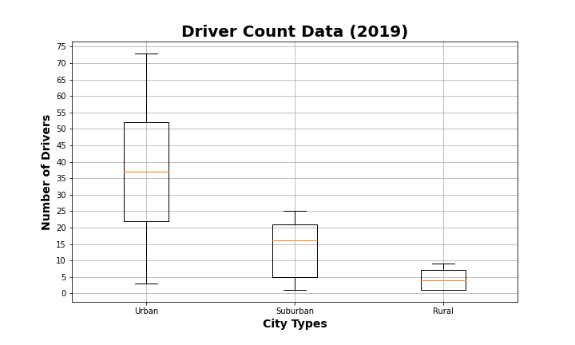
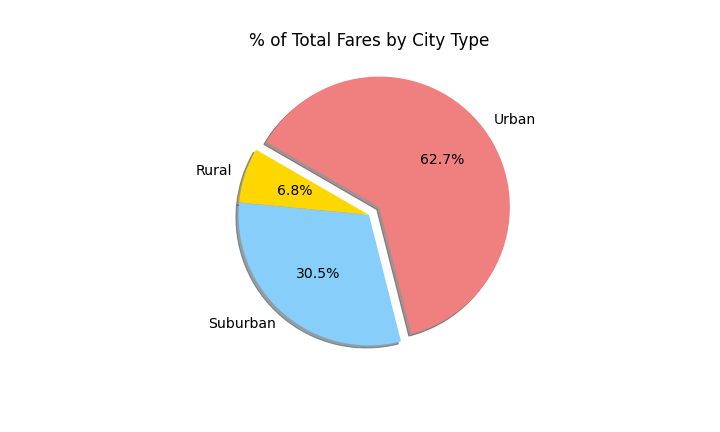

# PyBer_Analysis

## Overview of the Analysis
Utilizing data collected from various markets, this analysis endeavors to showcase the relationship between the type of city and the number of drivers and riders, as well as the percentage of total fares, total drivers, and total riders by type of city.

### Purpose
The purpose of this analysis is to allow PyBer to improve access to ride sharing services and determine affordability for underserved neighborhoods.

## Results of the Analysis
The following charts illustrate a clear pattern for Urban, Suburban, and Rural markets and highlight an opportunity to improve ridership in the Rural market.
 
PyBer Ride-Sharing Data (2019):

- In this inclusive overview, we see that urban market users represent a higher number of total rides, however have the lowest average fare per ride. 

Ride Count Data (2019):

- When isolating markets by city type, we can see that the number of rides given are mostly in the urban market, followed by the suburban market, and lastly the rural market.

Ride Fare Data (2019):

- Conversely, when isolating markets by city type, we can see that the cost of the rides given are highest in the rural market, followed by the suburban market, and lastly the urban market.

Driver Count Data (2019):

- While the highest fares come from rides in the rural market, these areas have the lowest number of drivers.

Percentage of Total Fares by City Type:

- The urban market represents the largest percentage of total fares when broken up by city type.
        
Percentage of Total Rides by City Type:   

    
- The urban market represents the largest percentage of total rides by city type.

Percentage of Total Drivers by City Type:

- The urban market represents the largest percentage of total drivers when broken up by city type.
    
Total Fare by City Type:

## Summary of the Analysis

When taking these figures into account, there are a few things to consider. Do PyBer's  goals include increasing the amount of riders, drivers, or fares for either the suburban or rural markets? Included are recommendations based on these observations:

- Rural customers are paying the highest fares, however are the smallest market represented. With a discount for rides over a stipulated distance or specified destination (ie, doctor's office, grocery store, voting location), you could increase participation from the Rural customer base.

- To increase the amount of drivers in the Suburban and Rural markets, you may offer a gas stipend to offset the cost of gas and make this a more enticing employment opportunity. Having more drivers available in these markets may increase customer participation.

- Targeted advertising initiatives may help with increasing brand awareness for Rural and Suburban markets. Mail inserts, local school sponsorships, and brand activation events are direct ways to engage with these markets.

- This analysis does not take into account the current state of inflation and subsequent gas prices, which will directly effect the amount of income for all rural drivers.
